# Harmony Hub

## Code Institute Septmeber 2024 Hackathon - Classical Music Month

## Overview 

The Harmony Hub is an interactive tool designed to help users of all skill levels improve their piano playing abilities. The app features a virtual keyboard and a series of flashcards displaying musical notes. Users are challenged to identify and press the corresponding keys on the virtual keyboard. Ideal for beginners looking to learn piano basics or for experienced players wanting to refine their skills, the app offers varying levels of difficulty to suit different proficiency levels. Whether you’re starting your musical journey or brushing up on your technique, this app provides a practical and engaging way to enhance your keyboard skills.

[live site](https://justynath.github.io/harmony-hackers/)

[GitHub repo](https://github.com/justynath/harmony-hackers)

## Table of Contents
1. [**Overview**](#overview) 
2. [**Planning**](#planning)
    - [**Aim**](#aim)
    - [**Targeted Audience**](#targeted-audience)
    - [**User Stories**](#user-stories)
3. [**UX**](#ux)
    - [**Strategy**](#strategy)
    - [**Scope**](#scope)
    - [**Structure**](#structure)
    - [**Skeleton**](#skeleton)
    - [**Surface**](#surface)
4. [**Technologies**](#technologies)
5. [**Agile Development Process**](#agile)
6. [**Features**](#features)
7. [**Testing**](#testing)
8.  [**Deployment**](#deployment)
9.  [**Anknowledgements**](#acknowledgements)

## Planning 

### Aim 

The aim of The Harmony Hub is to provide an easy-to-use platform for learning piano in a fun and structured way. It helps beginners start with music basics and gives advanced players a tool to improve their skills. With different difficulty levels and interactive exercises, the app helps users build confidence and fluency in reading music and playing the piano.

### Targeted Audience 

The Harmony Hub is designed for a wide range of users, from beginners to more experienced piano players. Beginners, including children and adults, can use the app to learn note recognition and basic keyboard skills in a simple, fun way. More advanced players can use it to improve their sight-reading and accuracy. Music teachers can also find it useful as a tool to enhance lessons and encourage regular practice. No matter your skill level, the app offers something for everyone looking to improve their piano skills.

### User Stories 

| User story ID [epicid.usid] | Task | Description | Issue No. |

**Developer**

As a developer, I want to create a landing page that sets the tone for the app and reflects its overall theme.

As a developer, I want to implement a flashcard system to display musical notes, allowing users to learn to recognize them.

As a developer, I want to create a feedback mechanism that confirms whether the correct key was pressed, providing users with instant results.

As a developer, I want to include tutorial and instructional resources within the app, so users can learn about keyboard skills.

As a developer, I want to introduce myself to users, showcasing my skills and involvement in the project.

As a developer, I want to establish a way to receive questions and feedback from users, helping me better understand their needs.

**User/Player**

As a player, I want to explore a visually appealing landing page, so I feel excited to start using the app.

As a player, I want to practice identifying musical notes with flashcards, so I can enhance my music skills in a fun way.

As a player, I want immediate feedback on my key presses, so I can quickly learn and adjust my technique.

As a player, I want easy access to helpful tutorials and instructions, so I can improve my understanding of keyboard skills at my own pace.

As a player, I want to learn about the creator of the app, so I can appreciate their expertise and vision.

As a player, I want to share my thoughts and questions about the app, so I can contribute to its improvement.

## UX 

### Strategy 
We want the app to display a note on the staff, and the user has to press the correct key on the keyboard. The app will provide instant feedback on whether the note is correct, helping users improve their note-reading skills through practice and repetition. Different difficulty levels will keep the learning engaging.

### Scope 
We aim for the app to includes features that allow users to learn and practice recognizing musical notes displayed on a staff. Users will press the corresponding keys on a keyboard, receiving immediate feedback on their accuracy. The app will also offer various levels of difficulty and engaging practice modes to enhance the learning experience. Additional resources, such as tutorials and instructions, may be included to support users in developing their note-reading skills.

### Structure 
The app's structure:

1. **Landing page:** The landing page serves as the introduction to the app, featuring a welcoming design. Users can easily access key features and see a prompt to start learning.
2. **Lessons Page:** The lessons page offers interactive lessons that focus on recognizing notes on a staff. 
3. **About Page:** The about page introduces the creators of the app, sharing their backgrounds, expertise, motivation and involvemnt in developing the app.
3. **Contact Page:** The contact page allows users to reach out with questions, feedback, or support requests. 

Each page includes **navbar** for smooth navigation, and **footer** containing information about the app purpose.

### Skeleton 

The website is clear and inviting, aiming to provide both entertainment and education. Features are organized by importance.

**Wireframes**

| Mobile | Desktop |
| --- | --- |
| Landing Page | 
|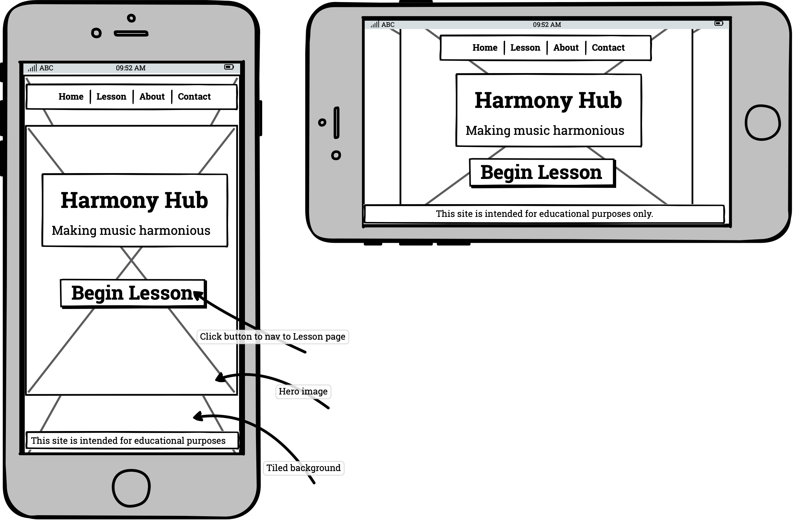 | 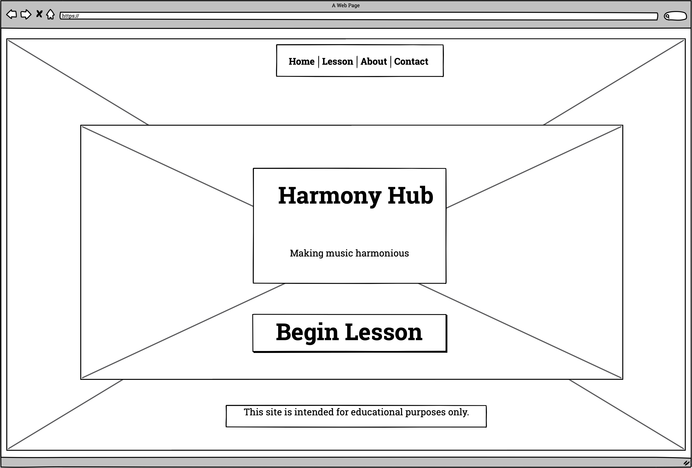 |
|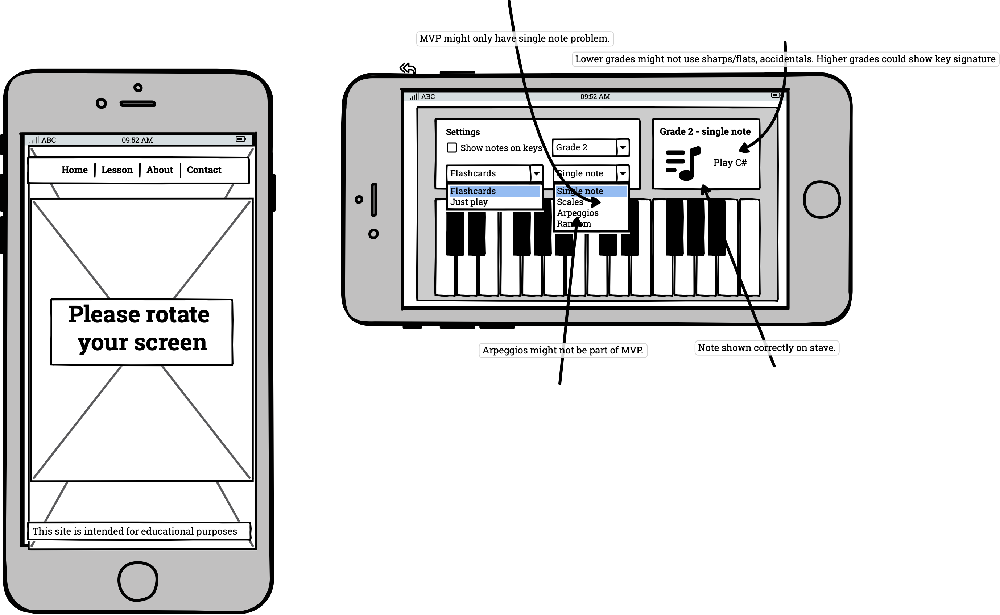 | 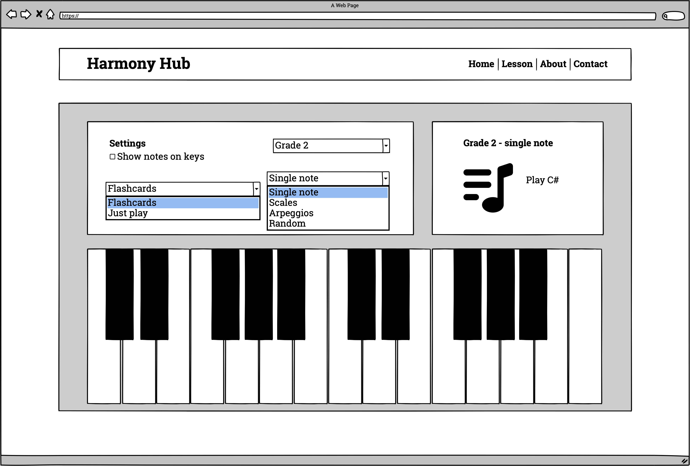 |
|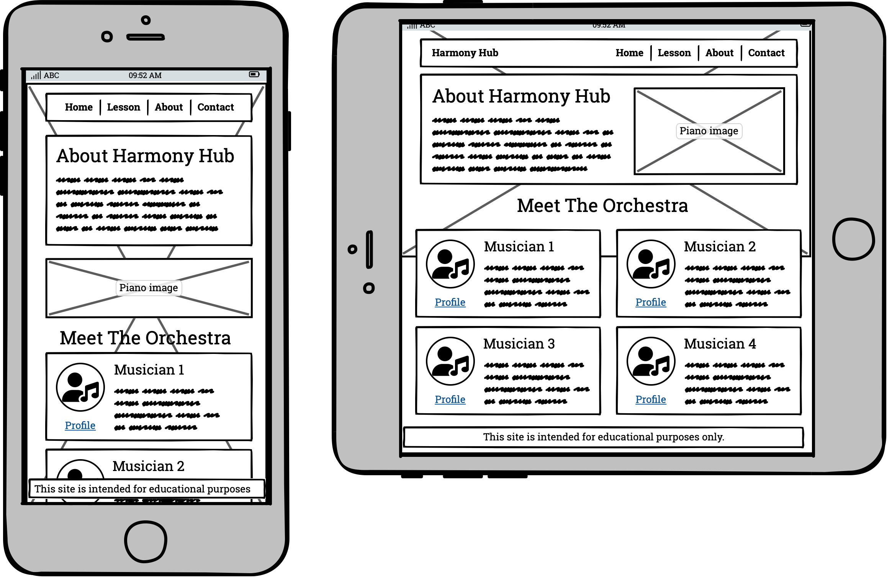 |  |
|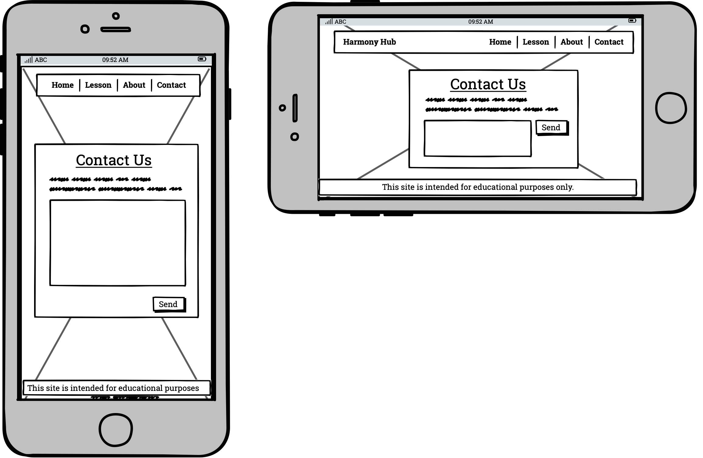 | 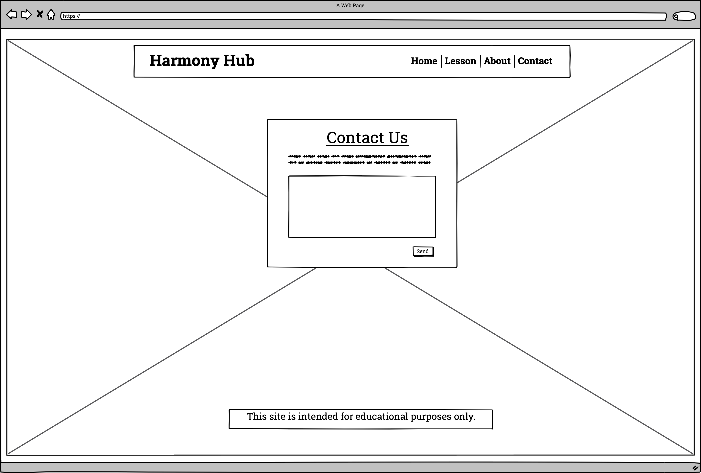 |

**Mockups**

| Mobile | Desktop |
| --- | --- |
| Landing Page | 
|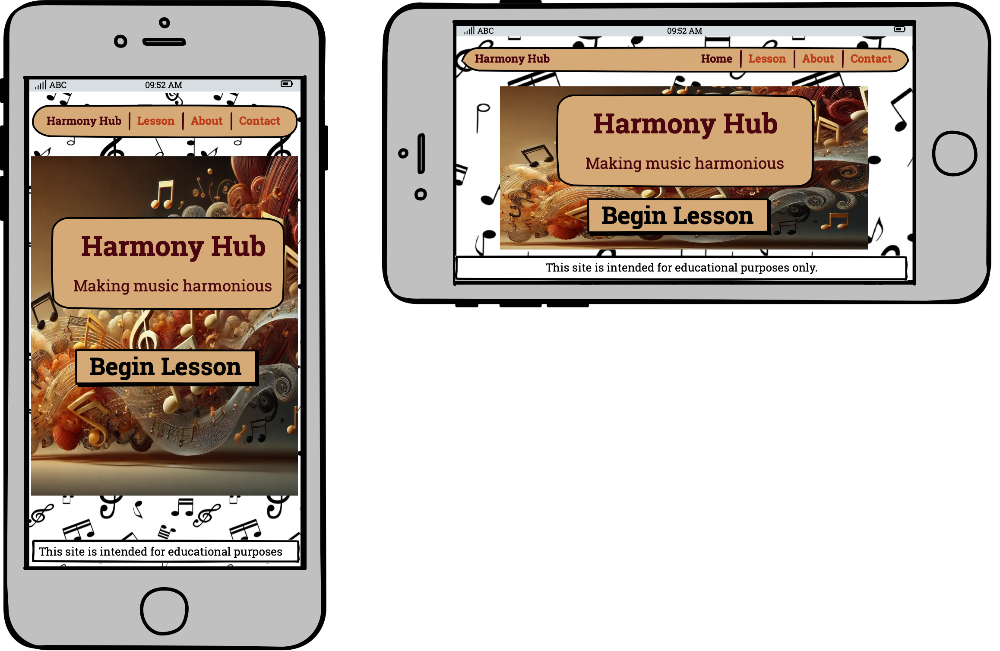 |  |
|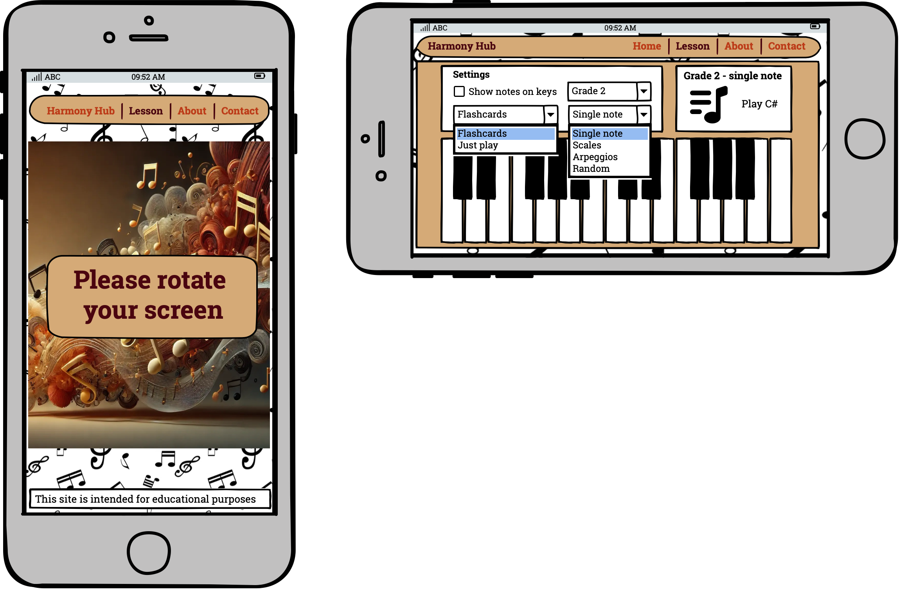 | 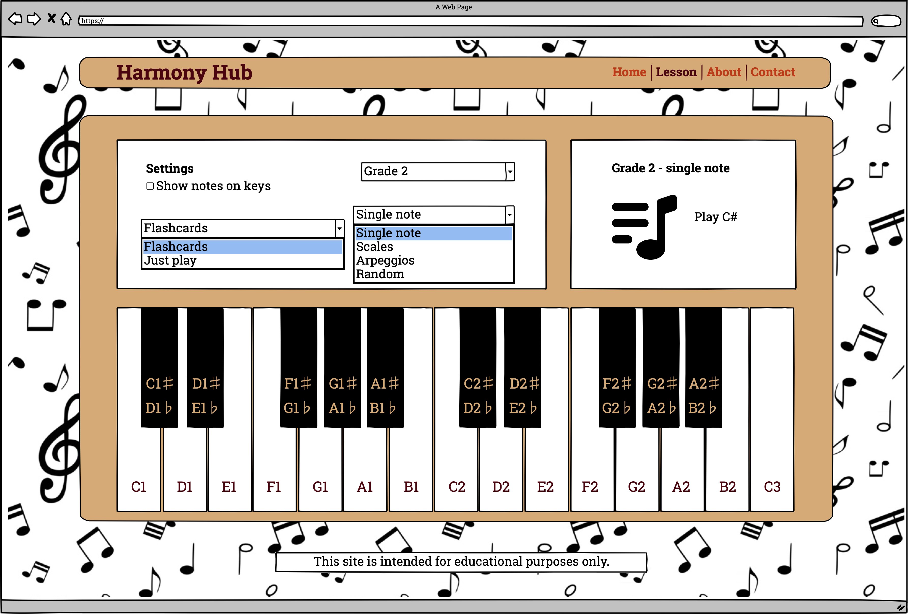 |
| | 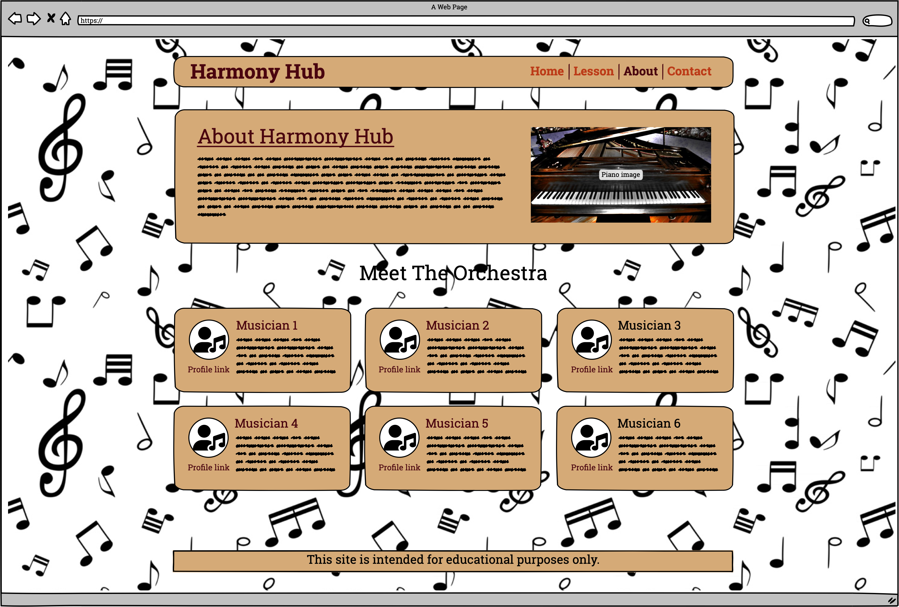 |
|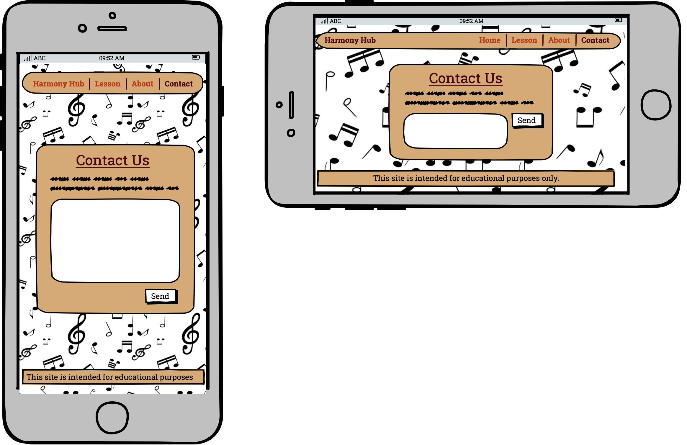 |  |

### Surface 

#### Colour Palette

We use this color palette as the base for a clean and aesthetic look.

 

#### Images

- The hero image was created by DALL-E and is designed to set the tone for a classical music experience.
- The background pattern features musical symbols to reinforce the musical theme.

## Technologies Used 

 used for the main site design and layout.

 Used to structure the main pages of the app, including the landing page, learning page, and about page, providing a solid foundation for the overall content layout.

 Employed to style the pages, creating a visually appealing front-end that enhances user experience through thoughtful design and layout.

) Implemented to build a responsive navbar and organize layouts for cards and flashcards, ensuring a seamless and user-friendly interface across all devices.

) Utilized to incorporate animations and dynamic features, enhancing interactivity and making the user experience more engaging.

 Applied to develop the core functionality of the app, including game mechanics and user interactions, allowing for a responsive and interactive learning environment.

 Used for creating wireframes and mockups, helping visualize the app's design and layout before development, ensuring a clear plan and efficient workflow.

 Used for version control to keep track of changes in the codebase. (`git add`, `git commit`, `git push`)

 Used for securely storing our code online, sharing the repository with team members, and enabling collaboration.

 used as a cloud-based IDE for development.

 Used as a local IDE for development, with built-in Git support and extensions to streamline coding and debugging.

**Sound Editing Software**: Employed to edit and refine audio components, ensuring high-quality sound for the app's musical elements.

**Open Broadcaster Software (OBS)**: Used for screen recording and presentations, allowing for the creation of tutorials and promotional content to showcase the app effectively.

## Agile Development Process 

**Agile Methodology**

Our project uses Agile methodology, which helps us adapt to changes and deliver work in small, manageable chunks, called sprints. This approach is great for staying flexible and responding quickly to new challenges in software development.

At the start of each sprint, we do sprint planning, where we: prioritise tasks from the product backlog, focusing on the most important ones, set clear goals for the sprint that align with our project milestones, assign tasks based on each team member's skills and availability.
Throughout the process, we balance scope, quality, time, and resources to deliver high-quality work efficiently. Agile keeps us focused and adaptable, ensuring we meet user needs while maintaining high standards.

We tracked progress daily using a simple Kanban board.es. Adopting Agile methodologies allows us to remain adaptable and focused, ensuring we meet user needs while striving for excellence.
These process were tracked daily using the basic Kanban board.

**Collaboration Tools** 

The team used Slack for quick communication and had two meetings a day to stay in sync. We also used GitHub Projects to track ideas, user stories, bugs, and our timeline.

We kept everyone updated on project progress and discussions by using the Slack team channel Canvas.

## Features 

### Landing Page 

### Lessons Page 

### About Page 

### Contact Page 

### Error Pages 

## Testing

## Deployment 

The site has been deployed using GitHub Pages. The deployment steps are as follows:

- Navigate to the Settings tab in the repository.
- Under the Source section, select the Main Branch from the drop-down menu.
- After selecting the main branch, the page will automatically refresh, and a status ribbon will confirm the successful deployment.

[live link](https://justynath.github.io/harmony-hackers/)

## Acknowledgements 

A big thank you to all fellow team members for their great work.

| Team Member | Role | GitHub |
| --- | --- | --- |
| Alan Chapman | Lead Designer/Content/Music Lessons |  |
| Hannah Olbrich | Frontend/Content/Music Lessons |  |
| Jibril Abshir | Lead Frontend Developer/Landing Page |  |
| Justyna Thompson | Presentation/Error Pages/Documentation |  |
| Shaun Anderton | Lead Javascript Developer/Music Lessons |  |
| Stephen Beese | Frontend/About Page/Music Lessons |  |
| Vernell Clark | Scrum Lead/Git + Github/Advisor |  |